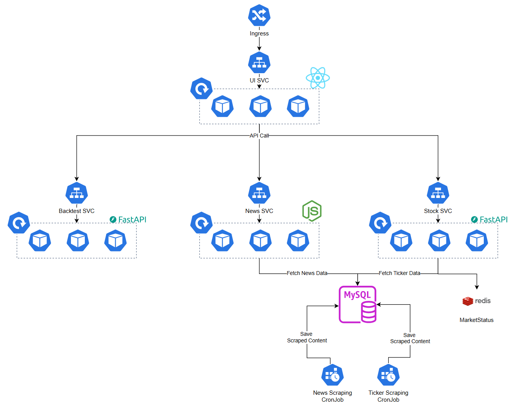

<div align="center">
    
</div>

# KubeStock
KubeStock은 쿠버네티스 기반의 통합 주식 서비스 플랫폼입니다. 주식 정보 조회, 금융 뉴스 수집, 포트폴리오 백테스팅 기능을 제공하는 마이크로서비스 아키텍처로 구성되어 있습니다.

## 목차
- [서비스 아키텍처](#서비스-아키텍처)
- [주요 기능](#주요-기능)
- [기술 스택](#기술-스택)
- [서비스 구성](#서비스-구성)
- [설치 및 배포](#설치-및-배포)
- [시작하기](#시작하기)

## 서비스 아키텍처


KubeStock은 각 기능별로 독립적인 마이크로서비스로 구성되어 있으며, 쿠버네티스를 통해 관리됩니다. 각 서비스는 컨테이너화되어 독립적으로 배포 및 확장 가능합니다.

## 주요 기능

### 1. 주식 정보 (Stock Info)
- 종목 차트 조회
- 시장 히트맵 시각화
- 경제 캘린더 및 이벤트 정보
- 다양한 주식 데이터 분석 도구

### 2. 금융 뉴스 (Financial News)
- 다양한 소스에서 금융 뉴스 수집 및 제공
- 뉴스 스크래핑 및 분류
- 주요 시장 동향 정보

### 3. 백테스팅 (Stock Backtesting)
- 사용자 정의 포트폴리오 구성
- 과거 데이터 기반 투자 전략 백테스팅
- 포트폴리오의 기간별 성과 분석

## 기술 스택

### 백엔드
- **언어**: Python 3.11+, Python 3.12
- **프레임워크**: FastAPI
- **백테스팅 엔진**: Backtrader
- **데이터 처리**: Pandas, NumPy
- **주식 데이터**: yfinance
- **데이터베이스**: MySQL
- **캐싱**: Redis

### 프론트엔드
- **프레임워크**: React 19
- **라우팅**: React Router
- **UI 라이브러리**: Material UI (@mui)
- **차트 시각화**: Nivo, lightweight-charts
- **HTTP 클라이언트**: Axios
- **날짜 처리**: Day.js

### 인프라
- **컨테이너화**: Docker
- **오케스트레이션**: Kubernetes
- **IaC**: Terraform
- **웹 서버**: Nginx

## 서비스 구성

### 1. 주식 정보 서비스 (`src/stocks`)
주식 종목 검색과 시장상태 확인 등을 담당하는 서비스입니다. FastAPI를 기반으로 구현되었으며, yfinance 라이브러리를 통해 주식 데이터를 가져옵니다.

### 2. 뉴스 서비스 (`src/news`)
금융 뉴스를 수집하고 제공하는 서비스입니다. 뉴스 스크래퍼와 서비스 모듈로 구성되어 있습니다.

### 3. 백테스팅 서비스 (`src/backtest`)
사용자가 구성한 포트폴리오에 대한 백테스팅을 수행하는 서비스입니다. Backtrader를 활용하여 구현되었습니다.

### 4. 사용자 인터페이스 (`src/ui`)
React 기반의 웹 인터페이스를 제공합니다. Material UI 컴포넌트와 다양한 차트 라이브러리를 활용하여 직관적인 사용자 경험을 제공합니다.

## 설치 및 배포

### 사전 요구사항
- Docker
- Kubernetes 클러스터
- Terraform (인프라 프로비저닝용)

### 배포 방법
1. 저장소 클론:
```bash
git clone https://github.com/omoknooni/KubeStock.git
cd KubeStock
```

2. Terraform을 사용한 인프라 프로비저닝:
```bash
cd deploy/terraform
terraform init
terraform apply
```

3. Kubernetes에 배포:
```bash
kubectl apply -f deploy/kubernetes/db/
kubectl apply -f deploy/kubernetes/stocks/
kubectl apply -f deploy/kubernetes/news/
kubectl apply -f deploy/kubernetes/backtest/
kubectl apply -f deploy/kubernetes/ui/
```

## 시작하기

각 서비스는 독립적으로 개발 및 실행할 수 있습니다:

### 주식 정보 서비스
```bash
cd src/stocks
pip install -r requirements.txt
uvicorn app.main:app --reload --port 8000
```

### 백테스팅 서비스
```bash
cd src/backtest
pip install -r requirements.txt
uvicorn app.main:app --reload --port 8001
```

### UI 서비스
```bash
cd src/ui
yarn install
yarn start
```
